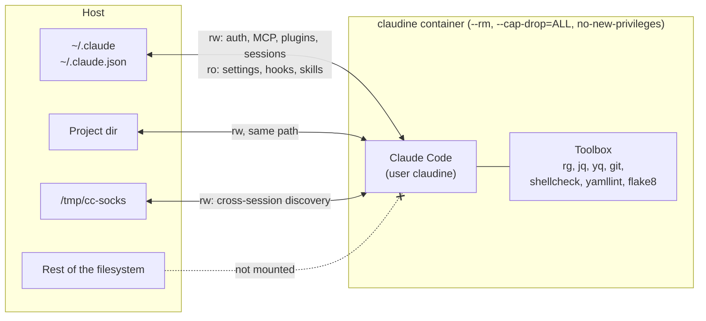

# claudine

Run Claude Code in a locked-down Docker or Podman container that reuses your host config (`~/.claude`, `~/.claude.json`): auth, settings, MCP servers and history carry over from a native install, which claudine is meant to replace.

- Only the project directory is writable, at the same path as on the host.
- Read-only root filesystem (tmpfs for `/tmp`, `~/.cache`, `~/.config`, `~/.local/state`), all capabilities dropped, `no-new-privileges`, 8 GB memory and 4096 PIDs caps, throwaway container (`--rm`).
- Several sessions can run side by side, even on different project dirs: in practice, they discover and message each other through Claude Code's cross-session commands (`ListAgents`, `SendMessage`), via the shared `/tmp/cc-socks`.
- Claude Code updates come from `./run.sh --rebuild` (auto-updater disabled).

> [!WARNING]
> This is best-effort isolation, not a security boundary. It does not hold against an exploited vulnerability (container runtime, kernel, Claude Code, a tool in the image) or any other escape path the agent may find. Network access is unrestricted: anything readable in the container (project, `~/.claude`, credentials) can be sent out. Use at your own risk, see [LICENSE](LICENSE).

## Requirements

- Docker (with BuildKit, the default on recent versions) or rootless Podman

Tested on Ubuntu 24.04, Ubuntu 26.04 and Debian 13. The first run builds the image, then log in from the session with `/login`.

## Migrating from a native install (recommended)

Uninstall Claude Code from the host and use claudine only: a session can add MCP servers to `~/.claude.json`, which any `claude` on the host (CLI, IDE extension, desktop app) would then run outside the container.

```sh
rm -rf ~/.local/bin/claude ~/.local/share/claude   # native installer
npm uninstall -g @anthropic-ai/claude-code         # npm install
```

Keep `~/.claude/` and `~/.claude.json`: claudine reuses their auth, settings, MCP servers and history.

## Usage

```sh
git clone https://github.com/oddballfr/claudine.git
cd /path/to/your/project
/path/to/claudine/run.sh
```

```text
Usage: ./run.sh [project-dir] [--rebuild] [--docker|--podman]

  project-dir   Directory to mount as the container's workspace (default: cwd)
  --rebuild     Rebuild the image from scratch (latest claude and Debian fixes)
  --docker      Use docker (default when installed)
  --podman      Use rootless podman (default when docker is missing)

The runtime can also be set with CLAUDINE_RUNTIME=docker|podman.
```

Examples:

```sh
./run.sh                   # open a session on the current directory
./run.sh ~/code/myapp      # open a session on ~/code/myapp
./run.sh --rebuild         # rebuild the image first
./run.sh --podman          # use podman instead of docker
```

Shell function for `~/.bashrc` or `~/.zshrc`:

```sh
function claudine () {
  /path/to/claudine/run.sh "$@"
}
```

### Extra environment variables

Host variables are not passed to the container. For those a skill or tool needs (API tokens, URLs), create `claudine.env` next to `run.sh`: it is loaded with `--env-file` when present and ignored by git.

```sh
# claudine.env: KEY=value per line, no quotes, no expansion
JIRA_URL=https://example.atlassian.net
JIRA_EMAIL=me@example.com
JIRA_API_TOKEN=xxxxxxxx
```

## How it works



| Host | Container | Why |
|---|---|---|
| `~/.claude` | `/home/claudine/.claude` (rw) | Config, auth, sessions |
| `~/.claude.json` | `/home/claudine/.claude/.claude.json` (rw) | Main config (`CLAUDE_CONFIG_DIR`) |
| project dir | same path (rw) | Only writable workspace |
| `/tmp/cc-socks` | `/tmp/cc-socks` (rw) | Cross-session discovery |

- `settings.json`, `CLAUDE.md`, `hooks/`, `skills/`, `agents/`, `commands/`, `rules/` and `output-styles/` are read-only, so a session can't plant a hook that runs in later sessions. A writable `settings.json` would let it grant itself permissions or add hooks and MCP servers, and a writable `CLAUDE.md` would let it rewrite its own rules: either is a way out of the sandbox. Edit them manually on the host; Claude can't change them, even when asked. Claude Code permission rules (`deny`) don't protect them: they only match specific tools and paths and are easily bypassed (Bash, scripts, symlinks, MCP servers). The read-only mount is enforced by the kernel, which is why claudine relies on the container rather than on permissions.
- The project's `.git/hooks` and `.git/config` are read-only: both can run commands through the host's `git`. Not covered: git dirs created by the session (`git init`), worktrees and submodules. Review them before running `git` on the host.
- No `--pid=host`: host processes stay invisible.
- Hooks and MCP servers run inside the container: those relying on host-only paths or `127.0.0.1` services need adapting.

## Development scripts

Not needed to use claudine: `run.sh` is self-contained.

| Script | Purpose |
|---|---|
| `scripts/build.sh [--no-cache]` | Build the image. `--no-cache` also refreshes Debian packages. |
| `scripts/security-scan.sh [--all]` | [trivy](https://trivy.dev/) scan, fails on fixable HIGH/CRITICAL. `--all` lists unfixed ones too. |

## Linters

| Linter | Checks |
|---|---|
| [shellcheck](https://www.shellcheck.net/) | Shell scripts: quoting, portability, common pitfalls |
| [yamllint](https://yamllint.readthedocs.io/) | YAML files: syntax, indentation, duplicate keys |
| [flake8](https://flake8.pycqa.org/) | Python files: errors (pyflakes) and style (pycodestyle) |

## Adding tools

Edit the `Dockerfile`, then run `./run.sh --rebuild`.

Debian packages only: add them to the `apt-get install` list of the final stage.

## License

[MIT](LICENSE)
